# Cartonization Service - Architecture Diagrams

## 1. High-Level System Architecture

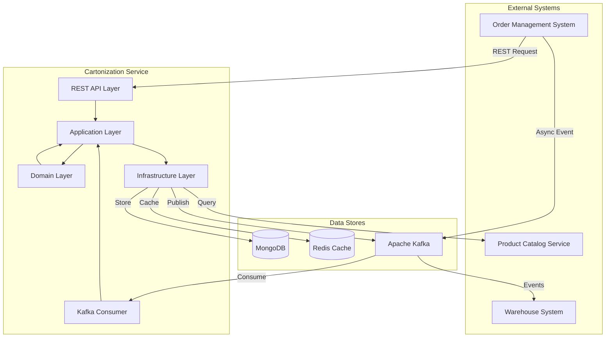

## 2. Hexagonal Architecture Detail

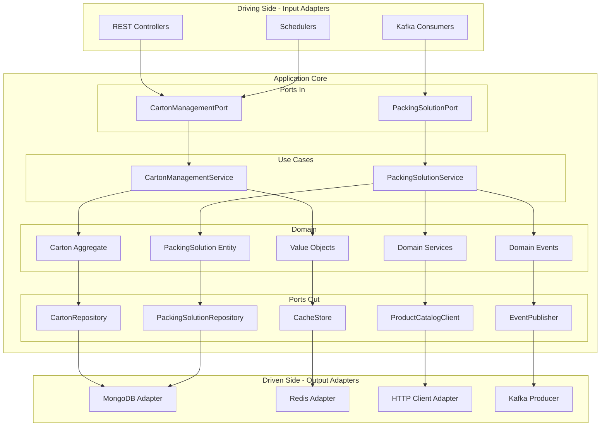

## 3. Cartonization Request Flow

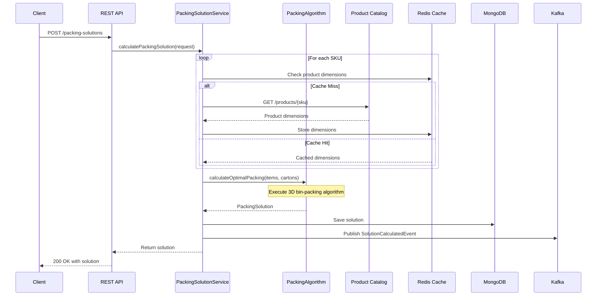

## 4. Event-Driven Flow

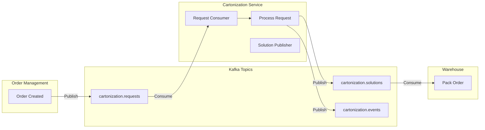

## 5. Domain Model Class Diagram

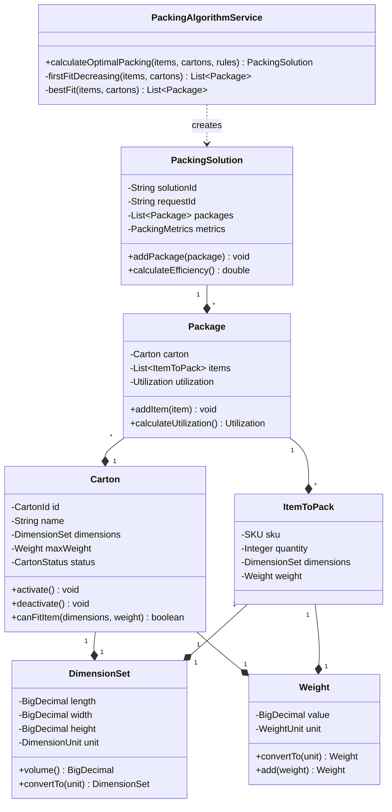

> For a detailed breakdown of each domain object, including its role as an Aggregate, Entity, or Value Object, please see the [Domain Model Documentation](./domain-model.md).

## 6. Data Flow Architecture

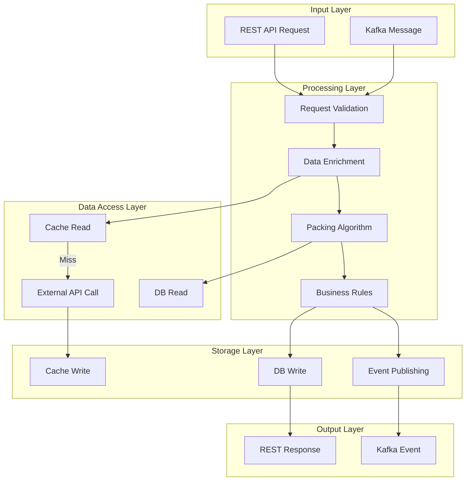

## 7. MongoDB Document Relationships

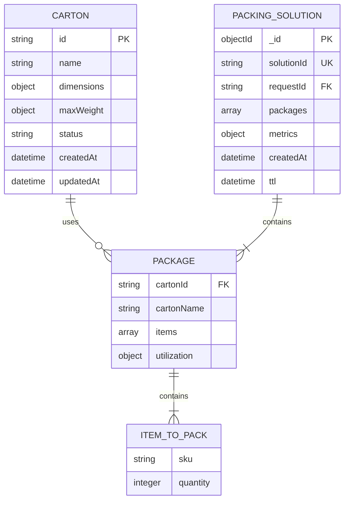

## 8. Deployment Architecture

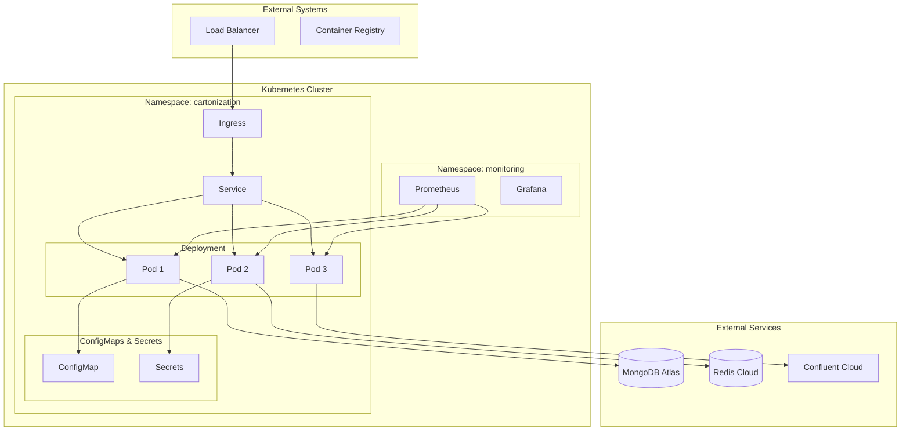

## 9. Circuit Breaker Pattern

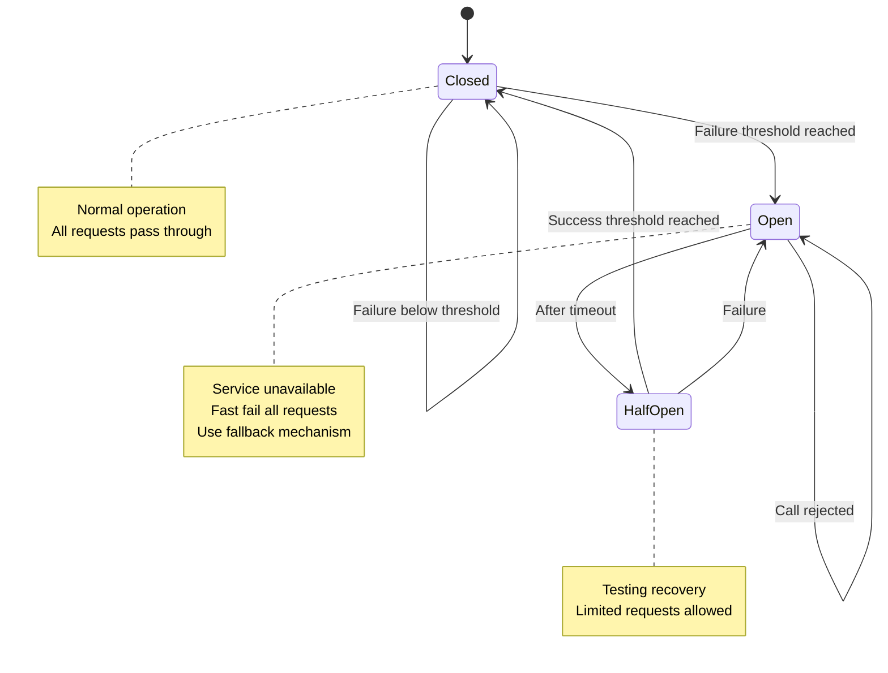

## 10. Caching Strategy

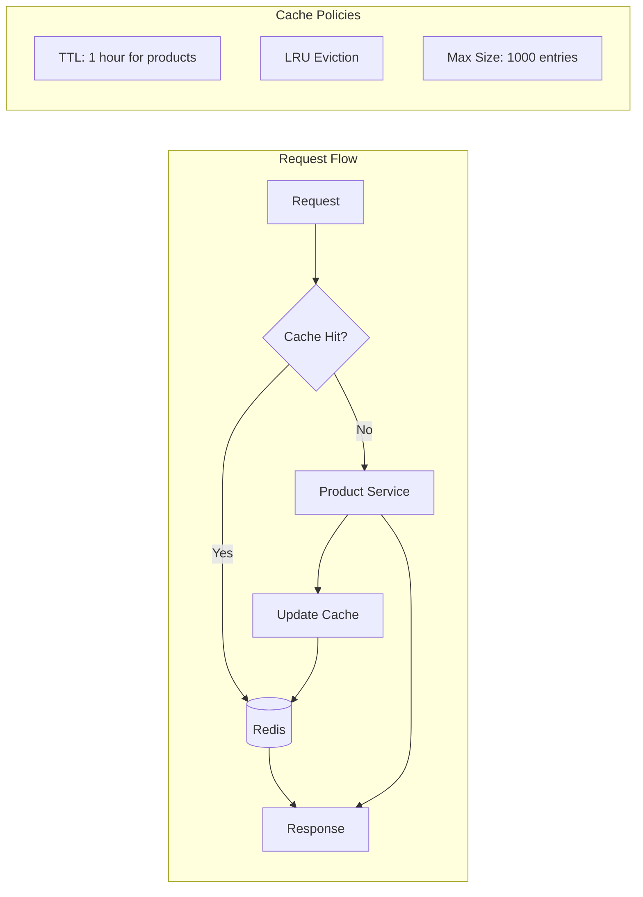

## 11. Error Handling Flow

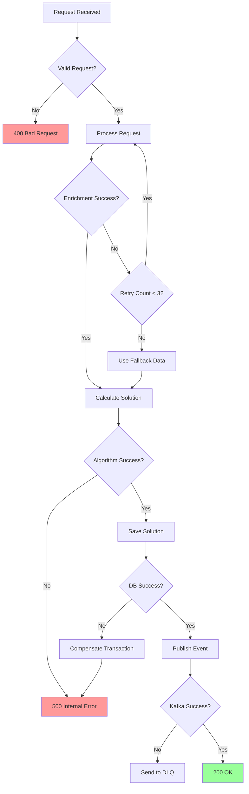

## 12. Testing Pyramid

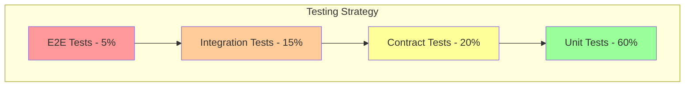

## 13. Development Workflow

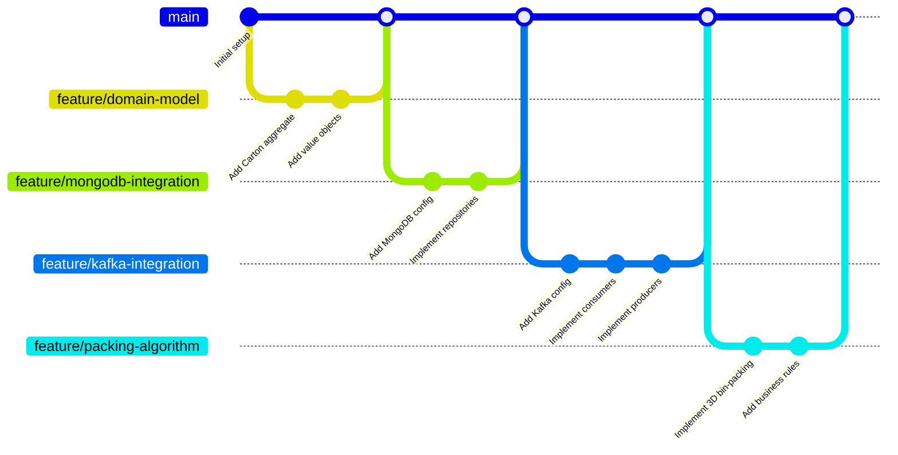

## 14. API Request/Response Flow

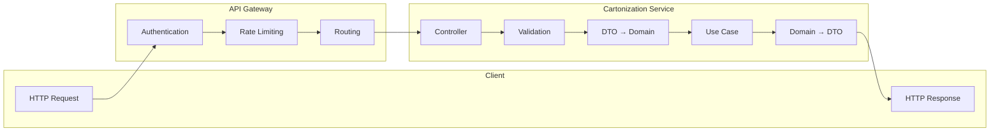

These diagrams provide a comprehensive visual representation of:
- System architecture and component interactions
- Hexagonal architecture implementation
- Request flows and sequence diagrams
- Domain model relationships
- Deployment architecture
- Error handling and resilience patterns
- Testing strategy
- Development workflow

Each diagram is designed to be clear and informative, helping developers understand different aspects of the system at various levels of abstraction.